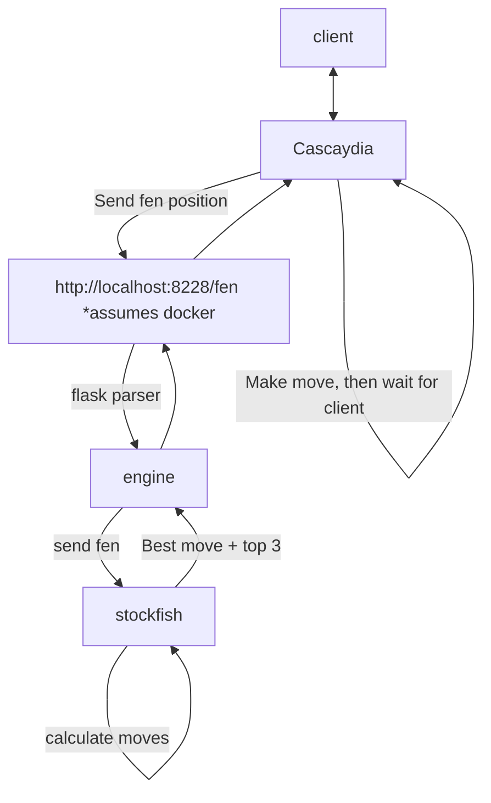
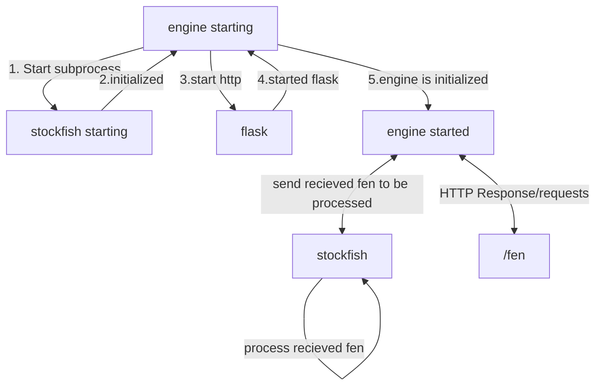
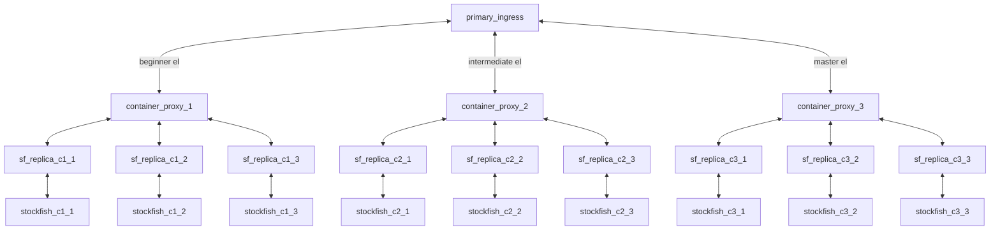

# Stockfish Engine Wrapper

This microservice is intended to wrap the [stockfish engine](https://stockfishchess.org/) and allow it to be interactive over HTTP.

## Usage

There are 2 ways to use the service:

- Docker; Through compose or a direct container
- Local; Straight on your machine

### Docker Usage

There are two ways to use this service with docker

#### Normal docker

1. build the image and tag it as sf-testing: `docker build . -t sf-testing`
2. Start the container with the image. `docker run -d -p "8228:8228" sf-testing` This will spit out a contianer hash, you will need this later to stop the container if you're not running docker desktop.
3. Head to [http://localhost:8228](http://localhost:8228) to confirm it's working

To stop the container run: `docker stop <container hash>`

#### Docker compose

Add the following config to your docker compose (if it's not there):

```yml
... # other Docker config
services:
  ... # other services
  engine:
    build: ./engine-testing
    restart: always
    ports:
      - 8228:8228
  ... # other services
```

Then run `docker compose up` to start the service. Head to [http://localhost:8228](http://localhost:8228) to confirm it's working

### Local Usage

You will need to have python3.8+ installed with pip for python 3:

1. Install dependencies with `pip install -r requirements.txt` (windows) or `sudo pip3 install -r requirements.txt` (macos/linux)
2. Run the server with `python app.py`. It should be available at [http://localhost:8228](http://localhost:8228).

## Testing

You can test fen usage with the following script. You will need to install requests with `pip install requests`(windows) or `sudo pip3 install requests` (macos/linux). Run the server in one terminal process with `python app.py` or `python3 app.py`, then run the following code in another terminal process:

```python
import requests

port = 8228
r = requests.post(f"http://localhost:{port}/fen",
    json={ "fen":"6qk/8/5P1p/8/8/6QP/5PP1/4R1K1 w - - 0 1"}
)
r.json() """{'move': 'e1e8',
            'top_3': [
              {'Centipawn': None, 'Mate': 2, 'Move': 'e1e8'},
              {'Centipawn': None, 'Mate': 3, 'Move': 'g3c7'},
              {'Centipawn': 6288, 'Mate': None, 'Move': 'g3g8'}
            ],
            'wdl': [1000, 0, 0]}""
```

## Implementation notes & Diagrams

Here are some additional notes that may be useful for people looking to work with the microserice

### AI game flow

Below are details for how communication happens with stockfish during AI games



### Startup Process

Below are details for how the stockfish engine starts



## Todo

- [ ] Load balance the initial container with 3 replicas
  - [ ] Allow ability to set ELO from CLI and do seperated architecture for tiered bots

Overall architecture:

- each container proxy for 3 instances of different ELO
- primary ingress does overall load balancing across all ELO's
- each replica will have an LRU cache for responses to 30 fen's



Individual container startup would have an environment variable for each elo
